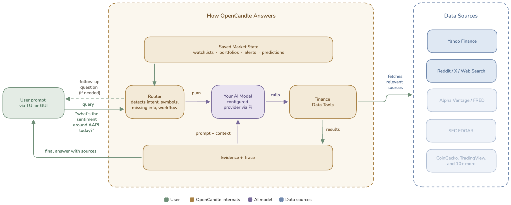

# System Architecture

OpenCandle is an open source financial investigator. You ask a question in the web app at web.opencandle.app, the local GUI, or the terminal (TUI); OpenCandle figures out what kind of investigation it is, gathers evidence from finance tools, keeps the trace visible, and produces an answer that names risks and data gaps.

It is not an automated trading system and it is not a financial advisor. It is research software built to make the evidence path inspectable.



## The Everyday Flow

```text
User question
  |
  v
Understand the financial task
  - symbols, companies, assets, portfolio details
  - time horizon, risk profile, budget, strategy, or missing details
  - whether this is education, comparison, portfolio review, options, sentiment, filings, macro, or state tracking
  |
  v
Choose an investigation path
  - use a structured workflow when the user asks for one
  - otherwise prepare a finance-specific evidence plan for the question
  - ask a focused follow-up only when the missing detail changes the answer
  |
  v
Gather tool-backed evidence
  - quotes, histories, options chains, fundamentals, filings, macro data
  - sentiment, web/news context, portfolio state, risk, correlations, backtests
  - provider freshness, missing credentials, stale cache, or degraded data
  |
  v
Produce the answer
  - cite what was actually checked
  - separate facts from judgment
  - call out uncertainty and downside scenarios
  - answer directly when the user asks for a decision or tradeoff
```

## User Interfaces

OpenCandle has three surfaces.

The terminal UI is the fastest way to work from the keyboard. It supports normal chat, slash commands, model setup, provider connection, and saved [Pi](https://github.com/earendil-works/pi) sessions.

The local GUI is a browser workbench at `http://127.0.0.1:14567`. Its home is a market dashboard (an indices strip, watchlist movers, a portfolio summary, and alerts status), and it adds per-symbol pages with interactive charts, chat answers rendered as chart cards, session history, a tool/workflow catalog, and a settings page covering model, data providers, saved preferences, notifications and automation, diagnostics, and data and privacy.

The web app at web.opencandle.app is the same agent and tools running entirely in your browser via an in-browser Node runtime, with nothing to install and your data kept in the browser. See [How the Web App Works](./how-the-web-app-works.md) for details.

All three surfaces use the same OpenCandle session and finance tools. The GUIs add richer rendering and easier discovery; neither is a separate agent.

## Workflows And Regular Questions

Some prompts map cleanly to visible workflows:

| Workflow | Use it for |
| --- | --- |
| Comprehensive Analysis | A broad single-asset investigation such as `/analyze NVDA`. |
| Compare Assets | Side-by-side comparison of stocks, ETFs, crypto assets, or funds. |
| Portfolio Builder | Building a proposed allocation from goals, budget, horizon, and risk preference. |
| Options Screener | Looking at calls, puts, covered calls, protective puts, expirations, and Greeks. |

Regular chat questions still get structure. For example:

- "Does adding NVDA make sense if I already own AAPL and TSLA?"
- "Is this SPY/MSFT retirement portfolio too risky?"
- "Is ARMH still the right ticker for Arm?"
- "Should I keep cash in HYSA, T-bills, CDs, or a bond ETF?"

Those are not just freeform replies. OpenCandle still extracts the relevant entities, chooses useful evidence, asks for clarification when needed, and applies the right answer shape for the task.

## Clarifying Questions

OpenCandle should ask a follow-up only when the missing information materially changes the investigation.

Good examples:

- An unknown ticker appears in an earnings-risk question.
- An options request is missing the underlying position.
- A portfolio-construction request has no budget, horizon, or risk preference.

In the GUI, these appear as question cards in the chat. After you answer, OpenCandle continues the investigation and uses tools; it should not stop at a generic response.

## Tools And Providers

Tools are small finance capabilities. They fetch and format data. They should not invent market facts or make the final investment conclusion. Provider helpers add caching, rate limiting, fallback behavior, and degraded-state metadata; if a provider is missing, stale, or unavailable, that shows up in the result instead of being hidden.

The full domain-by-domain map of tools and providers lives in [Data Sources](./data-sources.md).

## Evidence And Answer Quality

OpenCandle answers should be useful because the evidence is visible and the answer shape matches the question.

Expected behavior:

- A current-price question should show the quote source and freshness.
- A portfolio-risk question should discuss concentration, horizon, drawdown, and simple adjustments.
- An options question should distinguish per-share option quotes from standard 100-share contract cost.
- A ticker mismatch should be treated as a red flag before discussing social hype.
- A filing question should separate SEC filing evidence from news or market context.
- A pure education question should avoid unnecessary tool calls.

## GUI Runtime

The GUI server serves the built browser app, reads the current Pi session, and streams chat/session updates. Browser and terminal windows coordinate through the local server, so the same session can be open in several places without conflicting writes. See [GUI Quickstart](./gui-quickstart.md) for local usage and Tailscale access. The hosted web app has no local server; its runtime is described in [How the Web App Works](./how-the-web-app-works.md).

Useful local GUI endpoints:

- `GET /health` returns whether the process is alive plus diagnostic coordination metadata.
- `GET /api/bootstrap` returns the initial catalog, setup state, sessions, prompts, and current snapshot.
- `GET /api/sessions` lists saved sessions.
- `GET /api/session/events` returns the current projected chat events.
- `POST /api/local-coordinator/chat-run` submits one session-addressed chat run through the local coordinator.
- `GET /api/instruments/overview` returns cached company profile and key stats for one symbol (backs the symbol pages).
- `GET /api/instruments/history` returns validated range/interval history bars with request coalescing (backs the interactive charts).
- `GET /api/market-state/indices` returns the cached dashboard indices snapshot, including each instrument's `assetType`; chart data is fetched separately.
- `GET /api/market-state/sparkline?symbol=<symbol>&assetType=<type>` returns a size-bounded, validated Ticker Line SVG for a trusted GUI browser session. Add `metadata=1` to receive its source and exact data-as-of timestamp as JSON.
- `GET /ws` provides live updates for setup, catalog, session, and ask-user events.

## Local State

OpenCandle state defaults to `~/.opencandle/` for the local GUI and terminal; the state files and env overrides are documented in [Configuration](./configuration.md). The web app keeps its state in your browser instead.

Common files:

- `config.json` for provider keys and file-backed settings.
- `state.db` for memory, workflow state, and durable user market state such as instruments, watchlists, portfolio lots, alerts, report runs, and import provenance.
- `sentinel.db` for sentiment trend state.
- `onboarding.json` for provider setup, snooze, never-ask, and welcome state.

Pi owns its own runtime config and session storage separately. OpenCandle should not depend on repo-local `.pi/extensions/` artifacts.

## Validation

OpenCandle uses layered validation:

- Unit tests for deterministic logic, mocked providers, and GUI state helpers.
- End-to-end tests for CLI, credential flows, and live provider/tool behavior when needed.
- Browser smoke tests for the local GUI.
- Full-session evals that check whether the agent chose the right investigation path, used relevant tools, disclosed gaps, framed risk, and answered the user directly.
- Competitive evals that compare OpenCandle against generic agents on realistic finance prompts.

See [Testing and Evals](./testing-and-evals.md).
